# Test AI — Benchmarking AI Models on a Swift/iOS Task

A hands-on comparison of three AI coding models given **the same task, in the same empty
folder**, each run from its own CLI on that CLI's **default model**. The goal is to see how
far a model gets *on its own* on a production-like iOS task — no hints, no questions
along the way.

The task is defined in
**[AI_MODEL_SWIFT_IOS_BENCHMARK_PLAN.md](AI_MODEL_SWIFT_IOS_BENCHMARK_PLAN.md)** at the repo
root — every model was handed an identical copy of it. The app to build is called
**OrbitLab**.

> **On language.** The three runs were executed against a Danish version of the plan, and
> the models reported back in Danish. The plan and the reports have since been translated to
> English; the content is unchanged.

---

## Layout

```
.
├── AI_MODEL_SWIFT_IOS_BENCHMARK_PLAN.md   The task, identical for every model
├── claude/            OrbitLab built by Claude Opus 5 (Claude Code 2.1.270)
├── codex/             OrbitLab built by GPT-5 Codex (codex-cli 0.154.0)
├── mistral/           OrbitLab built by mistral-medium-3.5 — assisted run, see below
├── docs/screenshots/  Frames pulled from the screen recordings of each run
└── video/             Screen recordings of the three runs (not committed — see .gitignore)
```

Each model folder contains:

| File | Contents |
|---|---|
| `AI_MODEL_SWIFT_IOS_BENCHMARK_PLAN.md` | A link back to the plan at the repo root |
| `README.md` | The model's own documentation of its solution |
| `BENCHMARK_REPORT.md` | The model's self-report in a fixed template (status, duration, tokens, validation, errors and iterations) |
| `OrbitLab*/` | The actual Swift code, Xcode project and test targets |

---

## What the task tests

The plan is deliberately broad and hard to bluff your way through:

- **A SwiftUI app with four tabs** — Mission Control, Cube Lab, Telemetry, Settings.
- **An interactive, rotating 3D cube in SceneKit** — real 3D, not an image. Pause/resume,
  a speed slider, reset, touch rotation, lifecycle handling and reduce-motion support.
- **async/await, AsyncStream and correct cancellation** — a telemetry stream with a graph
  drawn by hand (Swift Charts is off the table, since the deployment target is iOS 15).
- **Persistence and dependency injection** — abstracted storage, swappable services.
- **Unit and UI tests** — runnable via `xcodebuild test` against a real simulator.
- **Accessibility and Dynamic Type** — labels, identifiers, light/dark mode, small and
  large screens.
- **Autonomous debugging** — the model may not ask the user questions; it must investigate,
  decide, document the decision and carry on.
- **Measuring wall-clock time and actual token usage**.
- **An external 100-point grading rubric** — which the model is *not* allowed to score
  itself against.

### Token measurement — important

The token fields in the report may **only** be filled in with real numbers from CLI/API
metadata. If a model cannot see its own usage, the fields must read `RUNNER_REQUIRED`.
They must never be estimated or guessed. The precise measurement therefore has to be
recorded by the **benchmark operator's CLI runner**, outside the model.

All three models correctly reported `RUNNER_REQUIRED` — so the token column below still
needs to be filled in from the CLI logs.

---

## Results

| | claude | codex | mistral |
|---|---|---|---|
| Model | Claude Opus 5 (1M) | GPT-5 Codex | mistral-medium-3.5 |
| CLI | Claude Code 2.1.270 | codex-cli 0.154.0 | unknown |
| Run type | Unassisted | Unassisted | **Assisted** |
| Self-reported status | COMPLETE | COMPLETE | COMPLETE (disputed) |
| Duration | 1,465 s (~24 min) | 1,151 s (~19 min) | ~4.5 h across restarts |
| Ships an iOS app | Yes | Yes | **No — library only** |
| Build | PASS | PASS | PASS (library) |
| Unit tests | PASS — 41/41 | PASS | PASS — 13/13 |
| UI tests | PASS — 4/4 | PASS | **FAIL — 0/4** |
| Total tests passed | **45** | **12** | **13** |
| Four working tabs | Yes | Yes | Code only, no app |
| 3D cube renders | Yes | Yes | **No** |
| Tokens | `RUNNER_REQUIRED` | `RUNNER_REQUIRED` | `RUNNER_REQUIRED` |

claude's and codex's numbers come from their own reports and the result bundles they
committed. mistral's row was re-verified by hand — every result below was reproduced locally
against the iPhone 17 Pro simulator, not taken from its report.

### Screenshots

Pulled from the screen recording of each run. Same four tabs, same order, for all three.

| | claude | codex | mistral |
|:--|:--:|:--:|:--:|
| **Mission Control** | 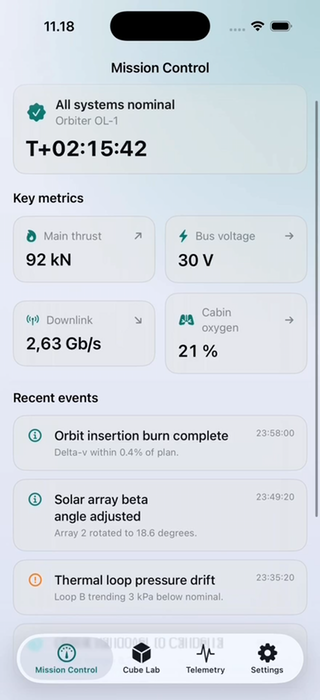 | 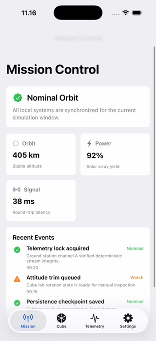 | 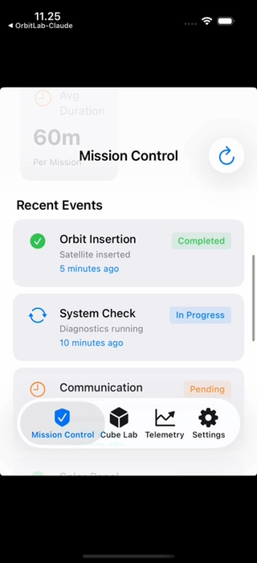 |
| **Cube Lab** | 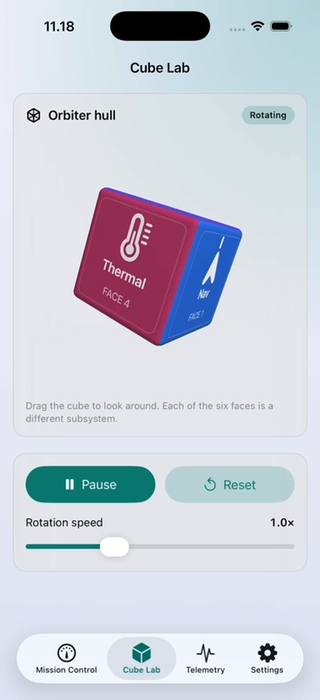 | 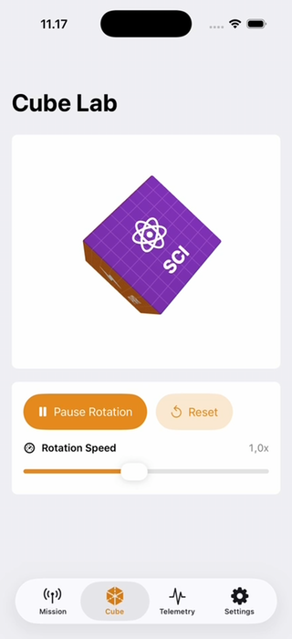 | 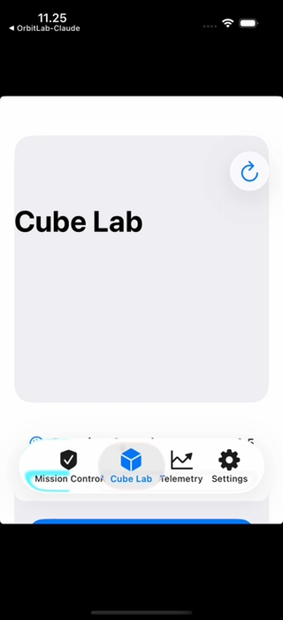 |
| **Telemetry** | 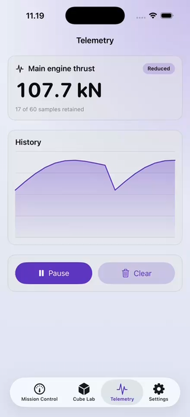 | 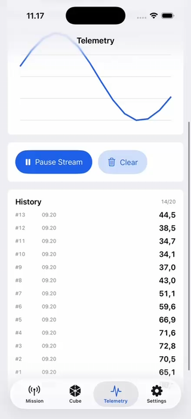 | 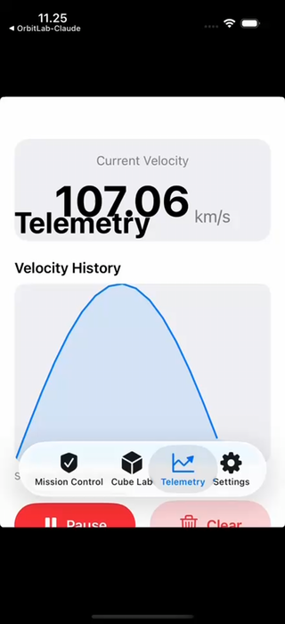 |
| **Settings** | 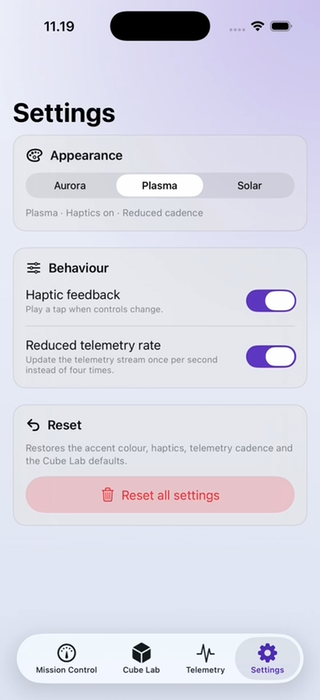 | 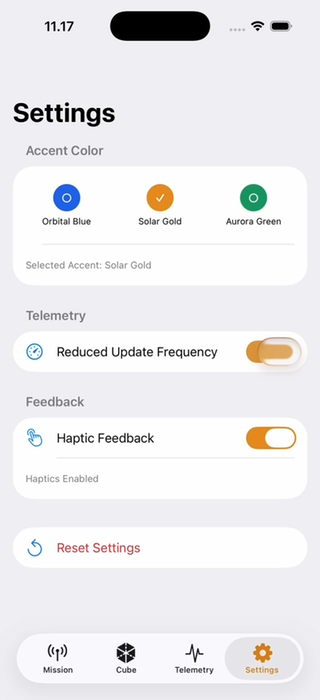 | 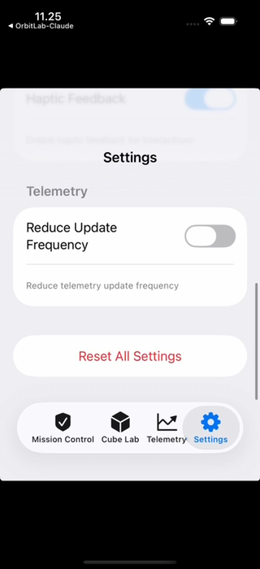 |

The mistral column is from the recording of an earlier attempt. Its current package builds
no app at all, so there is nothing left to screenshot — the views in the table are the
closest record of what its code renders.

What the screenshots show, beyond the tables:

- **claude** and **codex** both render a real, textured, rotating SceneKit cube with
  labelled faces, working playback controls and a speed slider.
- **mistral** renders **no cube at all** — the Cube Lab card is empty on every frame of its
  recording. The geometry is real `SCNBox`, but the default camera sits at z = −5 and a
  SceneKit camera looks down its own −Z axis, so it points away from the cube at the origin.
  Nothing continuously animates it either: the rotation is recomputed only inside
  `updateUIView`, which SwiftUI calls when state changes rather than once per frame. Its
  floating tab bar also overlaps page content and clips titles and buttons on all four tabs,
  and the app runs letterboxed because no launch screen is configured.
- All three ship a working accent-colour picker; claude's and codex's re-tint the whole app
  immediately, which is visible across the Telemetry and Settings shots.

### Validation and test results

Taken from each run's `BENCHMARK_REPORT.md`. See those files for the exact commands.

**claude** — 45/45 passing, 0 failed, 0 skipped

| Check | Result | Duration |
|---|---|---|
| Build (clean) | PASS, 0 compiler warnings | 6 s |
| Unit tests | PASS — 41/41 | 0.34 s |
| UI tests | PASS — 4/4 | 27.5 s |
| Full suite, iPhone 16 Pro / iOS 18.6 | PASS — 45/45 | 33 s |
| Full suite, iPhone SE 3rd gen / iOS 17.5 | PASS — 45/45 | 42 s |
| Placeholder scan | PASS — no TODO/fatalError/empty actions | — |

`TestResults.xcresult` is committed at `claude/TestResults.xcresult`. The whole unit suite
runs in 0.34 s because every dependency — mission service, telemetry source, its pacing,
persistence and haptics — sits behind a protocol with a test double, so nothing sleeps,
randomises or touches the network. The cube is verified automatically by an offscreen
`SCNRenderer` test that requires many distinct colours in the rendered output, so an empty
or flat scene would fail the suite.

**codex** — 12/12 passing, 0 failed, 0 skipped

| Check | Result | Duration |
|---|---|---|
| Build | PASS | 1 s |
| Unit tests | PASS | 3 s |
| UI tests | PASS | 26 s |

Result bundles are under `codex/build/`. Ran against a booted iPhone 17 Pro addressed by
simulator UUID. SceneKit rendering is validated only through build and UI navigation — no
pixel or snapshot assertions.

**mistral** — 13 unit tests pass, but there is no app

| Check | Result |
|---|---|
| Build (`xcodebuild -scheme OrbitLab`) | PASS — builds a **library**, no `.app` produced |
| Unit tests | **PASS — 13/13** in 1.0 s |
| UI tests | **FAIL — 0/4** |

Reproduced locally against iPhone 17 Pro / iOS 26.5. The 13 unit tests are real and they
pass. The four UI tests all fail the same way:

```
Assertion failure in -[XCUIApplication init], XCUIApplication.m:113
error: No target application path specified via test configuration
```

The cause is structural, not a flaky test. mistral abandoned the Xcode project — there is no
longer an `.xcodeproj` or a `project.yml` anywhere in its folder — and replaced it with a
Swift Package Manager package whose only product is `.library(name: "OrbitLab")`. A library
has no host app, so `XCUIApplication` has nothing to launch and no UI test can ever pass.
Building it produces `OrbitLab.o`, two `.xctest` bundles and no app bundle at all.

That trade is what unblocked the unit tests: the previous Xcode project declared all three
targets as `com.apple.product-type.application`, so `xcodebuild test` failed with
"There are no test bundles available to test." Moving to SwiftPM fixed the test bundles by
removing the application.

Two claims in its report do not hold up. The validation table lists
`xcrun simctl install ... build/Debug-iphonesimulator/OrbitLab.app` as PASS, but no such
bundle is produced by the current package. And the status reads COMPLETE while four required
tests fail and the plan's core deliverable — a buildable iOS app — is absent. The plan lists
"no buildable app or no real Xcode project" as an automatic disqualification.

### Notes per run

- **claude** generated the project with XcodeGen (`project.yml`) and committed the generated
  `.xcodeproj` so it builds without the tool installed. It found and fixed four issues on its
  own during the run — including a unit test whose wait condition was satisfied too early and
  therefore was not actually asserting what it claimed — and documented each one.
- **codex** wrote `project.pbxproj` directly and recovered from four build/test failures,
  including a mistyped simulator UUID and a force-unwrapped `XCUIApplication!` it found by
  searching its own output.
- **mistral** is marked as an **assisted run** and is not directly comparable to the other
  two. It stopped early and repeatedly and had to be restarted and nudged by hand throughout,
  across roughly four and a half hours and four separate attempts at the project structure.
  Along the way it could not get a hand-written `project.pbxproj` to parse, lost its own Swift
  files during a cleanup with no backup, left behind an accidental copy of Apple's visionOS
  project template, then generated a working Xcode project whose test targets were all
  declared as applications, and finally discarded that project for a SwiftPM library. Each
  attempt fixed the previous blocker by removing the thing that caused it; the last one
  removed the app. Its reported start and end times have been rewritten three times, always
  landing on round numbers, so treat the duration as an estimate rather than a measurement —
  unlike the token fields, which it correctly marks `RUNNER_REQUIRED` rather than guessing.

None of the runs have been scored against the 100-point rubric yet — that is the operator's
job (section 12 of the plan), and models are not allowed to score themselves.

---

## Verifying a run yourself

```bash
cd claude          # or codex
xcodebuild -project OrbitLab.xcodeproj -scheme OrbitLab \
  -destination 'platform=iOS Simulator,name=iPhone 16 Pro' \
  -derivedDataPath build/DerivedData clean build

xcodebuild -project OrbitLab.xcodeproj -scheme OrbitLab \
  -destination 'platform=iOS Simulator,name=iPhone 16 Pro' \
  -derivedDataPath build/DerivedData \
  -resultBundlePath TestResults.xcresult test
```

Swap the simulator name for one that actually exists locally
(`xcrun simctl list devices available`). Each model's own `README.md` documents the exact
command used during its run.

---

## Running the benchmark against a new model

1. Create an empty folder containing **only** a copy of
   [the plan](AI_MODEL_SWIFT_IOS_BENCHMARK_PLAN.md).
2. Start the model's CLI in that folder on its default model and ask it to execute the plan.
3. Give no hints along the way. If you do, mark the run as *assisted* — as the mistral run
   is here — and keep it out of the head-to-head comparison.
4. Record outside the model: model version, CLI version, reasoning/effort setting, context
   window, wall-clock start/end, input/output/cached/total tokens, tool-call count and exit
   status.
5. Use the same simulator state for every run.
6. Score the result against the rubric in section 12 of the plan — and check the list of
   automatic disqualifications (no buildable project, a "cube" that isn't real 3D, claimed
   success for checks that never ran, or a model that stops to wait for user input).
